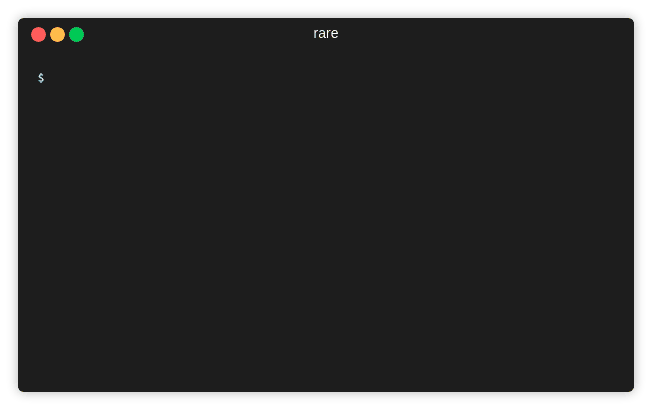

# rare

[](https://travis-ci.org/zix99/rare)

A file scanner/regex extractor and realtime summarizor.

Supports various CLI-based graphing and metric formats.



# Features

 * Multiple summary formats including: filter (like grep), histogram, and numerical analysis
 * File glob expansions (eg `/var/log/**` or `/var/log/*/*.log`)
 * Optional gzip decompression (with `-z`)
 * Following `-f` or re-open following `-F` (use `--poll` to poll)
 * Ignoring lines that match an expression
 * Aggregating and realtime summary (Don't have to wait for all data to be scanned)
 * Multi-threaded reading, parsing, and aggregation
 * Color-coded outputs (optionally)
 * Pipe support (stdin for reading, stdout will disable color) eg. `tail -f | rare ...`


# Docs

All documentation may be found here, in the [docs/](docs/) folder, and by running `rare docs` (embedded docs/ folder)

# Example

## Extract status codes from nginx logs

```sh
$ rare histo -m '"(\w{3,4}) ([A-Za-z0-9/.]+).*" (\d{3})' -e '{3} {1}' access.log
200 GET                          160663
404 GET                          857
304 GET                          53
200 HEAD                         18
403 GET                          14
```

## Extract number of bytes sent by bucket, and format

This shows an example of how to bucket the values into size of `1000`. In this case, it doesn't make
sense to see the histogram by number of bytes, but we might want to know the ratio of various orders-of-magnitudes.

```sh
$ rare histo -m '"(\w{3,4}) ([A-Za-z0-9/.]+).*" (\d{3}) (\d+)' -e "{bucket {4} 10000}" -n 10 access.log -b
0                   144239     ||||||||||||||||||||||||||||||||||||||||||||||||||
190000              2599       
10000               1290       
180000              821        
20000               496        
30000               445        
40000               440        
200000              427        
140000              323        
70000               222        
Matched: 161622 / 161622
Groups:  1203
```

# Output Formats

## Histogram (histo)

The histogram format outputs an aggregation by counting the occurences of an extracted match.  That is to say, on every line a regex will be matched (or not), and the matched groups can be used to extract and build a key, that will act as the bucketing name.

```
NAME:
   main histo - Summarize results by extracting them to a histogram

USAGE:
   main histo [command options] <-|filename>

OPTIONS:
   --follow, -f               Read appended data as file grows
   --posix, -p                Compile regex as against posix standard
   --match value, -m value    Regex to create match groups to summarize on (default: ".*")
   --extract value, -e value  Comparisons to extract
   --gunzip, -z               Attempt to decompress file when reading
   --bars, -b                 Display bars as part of histogram
   --num value, -n value      Number of elements to display (default: 5
```

## Filter (filter)

Filter is a command used to match and (optionally) extract that match without any aggregation. It's effectively a `grep` or a combination of `grep`, `awk`, and/or `sed`.

```
NAME:
   main filter - Filter incoming results with search criteria, and output raw matches

USAGE:
   main filter [command options] <-|filename>

OPTIONS:
   --follow, -f               Read appended data as file grows
   --posix, -p                Compile regex as against posix standard
   --match value, -m value    Regex to create match groups to summarize on (default: ".*")
   --extract value, -e value  Comparisons to extract
   --gunzip, -z               Attempt to decompress file when reading
   --line, -l                 Output line numbers
```

## Numerical Analysis

This command will extract a number from logs and run basic analysis on that number (Such as mean, median, mode, and quantiles).

Example:

```bash
$ go run *.go --color analyze -m '"(\w{3,4}) ([A-Za-z0-9/.@_-]+).*" (\d{3}) (\d+)' -e "{4}" testdata/access.log 
Samples:  161,622
Mean:     2,566,283.9616
Min:      0.0000
Max:      1,198,677,592.0000

Median:   1,021.0000
Mode:     1,021.0000
P90:      19,506.0000
P99:      64,757,808.0000
P99.9:    395,186,166.0000
Matched: 161,622 / 161,622
```


# License

    Copyright (C) 2019  Christopher LaPointe

    This program is free software: you can redistribute it and/or modify
    it under the terms of the GNU General Public License as published by
    the Free Software Foundation, either version 3 of the License, or
    (at your option) any later version.

    This program is distributed in the hope that it will be useful,
    but WITHOUT ANY WARRANTY; without even the implied warranty of
    MERCHANTABILITY or FITNESS FOR A PARTICULAR PURPOSE.  See the
    GNU General Public License for more details.

    You should have received a copy of the GNU General Public License
    along with this program.  If not, see <https://www.gnu.org/licenses/>.
